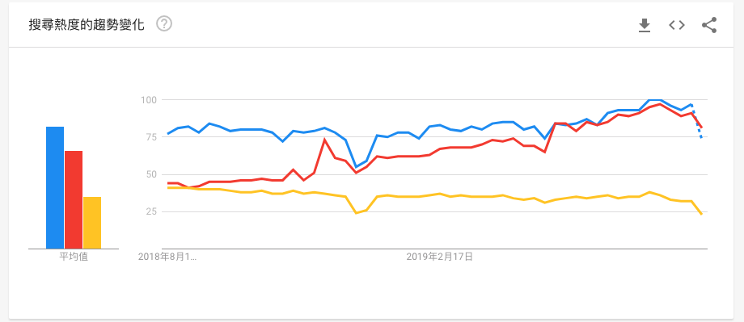

**在這篇文章中不會有完整的比較，只是分享一些使用上遇到的情境與問題，文章內容單純是個人意見，有不同的想法歡迎來討論**

---

**先歸納一些總結**：  
**效能方面**：Flutter 可能勝出但沒有到真的很明顯，畢竟兩者都可以產品化。  
**開發工具**：兩者差不多，都可以 live reload，但 Flutter 的 live reload 可以保持目前狀態。  
**元件與API**：React native 歷史較長久，有累積不少好用的元件與 API 可以加速開發。  
**社群人數**：一樣 React native 歷史較長久，StackOverflow 上可以找到大部分問題的解答，Flutter 可能就需要自行處理問題或發問等大神回覆。

---

在手機跨平台的 framework 當中，討論度最高的 framework 就是 React Native 與 Flutter，從下圖的 google trend 中可以看的出來最近兩者的搜尋次數是差不多的。而 Flutter 是有後來居上的趨勢，未來可望超過 React native。

**效能比較：**

APP 的效能就程式架構來說，Flutter 有經過 c/c++ compile 理論上是會勝過 React native，但網路上有文章說兩者的效能其實是差不多的，這個部分有興趣可以做點實驗來研究，**重點是兩者的效能都很不錯，都是真正可以產品化的技術。**

**開發工具：**

兩者的開發工具都有支援 Live reload 可以讓你改文 code 後儲存馬上就反應，所以開發起來都很快速順暢，但 Flutter 又更厲害一點，因為他可以保持目前的狀態(詳情請看 [Flutter 官方網站](https://flutter.dev/))。

**元件與API：**

這個部分就是React native 大勝，畢竟發展的歷史比起 Flutter 長了許多，累積了不少好用的元件與API (ex: Image Picker、Photo library api)，雖然兩者都可以透過實作 native language api 的方式來完成所有平台可以做到的事情，但有現成且好用的元件就大大減少了許多需要自行處理的問題。**如果是想要 prototype 或是產品有迫切的時程壓力可能就要好好比較一下關鍵的元件是否缺失。**

**社群人數：**

React native 有較長的歷史，留下的痕跡絕對是比 Flutter 多上許多的，所以在開發中遇到的問題，基本上 StackOverflow 都有人解答過了，省去了不少查資料翻 api 的時間。

---

**最後來提一下為何會嘗試了兩個 Framework。**

最近 side project 想做一個關於照片整理與上傳的 app，就嘗試了發展一段時間的 React native。因為有 React 的基礎所以實作起來真的很順手，直到遇到了照片上傳…。

React native 以 javascript 為 engine，建立了 javascript 與 native language 之間的 bridge，讓開發者可以在 javascript 中就完成 app 的建置。而這個 bridge 主要是使用 JSON string 來溝通。

雖然在 Browser 跟 node 的環境都有支援 blob，但不知道為什麼 React native 的環境 blob 的支援很殘破，想要上傳檔案都只能透過 React native API 將 local file 轉成 base64 的格式，才能做後續的處理。

查了許多資料，花了好幾天的時候一直都無法克服檔案上傳的問題(因為使用的雲端上傳 API 只支援 binary 檔案上傳，base64 轉檔一直無法成功)，所以就找到了 Flutter。

在花了三天看完 Flutter 的介紹與 tutorial 後，確定 Flutter 可以解決我遇到的檔案傳輸問題後，就準備開始了移植 React native code 的工程，結果還沒開始移植就遇到了問題。**我沒辦法取得手機裡面的照片…**

查了許久發現好像沒有相關的 API，所以得自己寫 native code 來取得資料，查到這裡我就放棄 Flutter 了，如果要寫 native code 就直接用 React native 就好。

在只是一個小 project 的情況下，我放棄了 Flutter 選擇回到了 API 還有元件較多的 React native，並放棄了資料上傳這件事。畢竟 React native 的 API 有支援照片存取，至少還可以寫整理相片的部分，沒有相關存取照片的 API 就算可以上傳 binary 資料也沒用，因為根本沒東西可以傳啊……