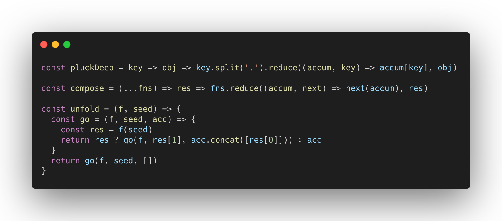
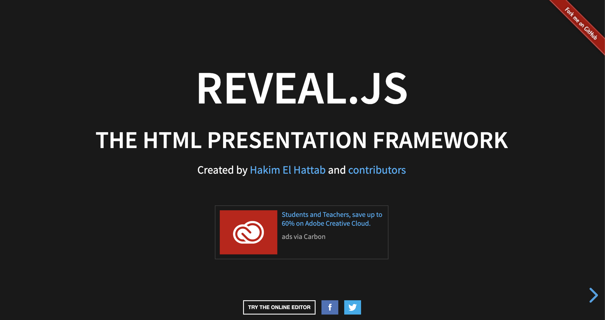
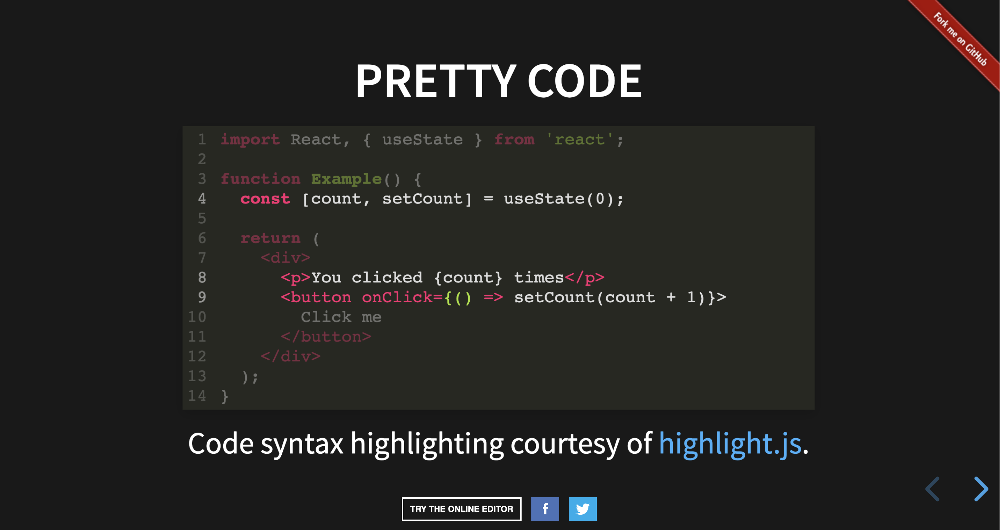

**簡單介紹一下自己用到或看到覺得好用的開發工具，這篇分享一下 code sharing 的工具**

在 demo 自己實作的程式時，常常需要分享寫出來的 code，但在製作投影片時，不像網頁或是文字編輯器的環境，有 syntax highlight 的幫忙，只能貼上跑版的純文字來炸別人眼睛，或是擷取文字編輯器的畫面。這些做法不是麻煩，就是不美觀。所以就找了幾個好用的工具來幫忙處理這些瑣事。

### [1. Carbon](https://carbon.now.sh/)

  (image from <a href="https://carbon.now.sh/">carbon</a>)

Carbon 可以把你的 code 轉成 png、svg，還可以建立 url，甚至 embed 進網頁。

使用方法就是點進網頁後把要分享的 code 貼上去，並調整成想要的樣式，之後 export 就可以選擇格式輸出。

### [2. Polacode](https://github.com/octref/polacode)

  (image from <a href="https://marketplace.visualstudio.com/items?itemName=pnp.polacode">polacode</a>)

Polacode 是 VSCode 的一個 extension，可以說是 Carbon 的延伸版，Polacode 的作者也說他受 Carbon 啟發。

功能上比 Carbon 更好用，是直接從文字編輯器輸出，可以直接拖拉改變輸出樣式。如果平常就是使用 VSCode 的話，十分建議安裝使用。

### [3. reveal.js](https://revealjs.com/#/)

Reveal.js 是提供網頁製作投影片的 Framework。以網頁為基礎，提供了大量的客製空間，網頁做的到的事情他都可以做的到，可以說是功能十分強大。

以 code sharing 的角度來看，Reveal.js 使用 highlight.js 來提供 syntax highlight，所以只要用 Reveal.js 來做投影片就不用擔心 code 沒有上色不好看。

如果喜歡寫 code，想用 html & javascript 來控制投影片，可以試試看 Reveal.js。此外 Reveal.js 也有提供類似 google slide 的線上編輯網頁，給不會寫 code 或習慣用 GUI 的使用者，都可以去參考使用看看。