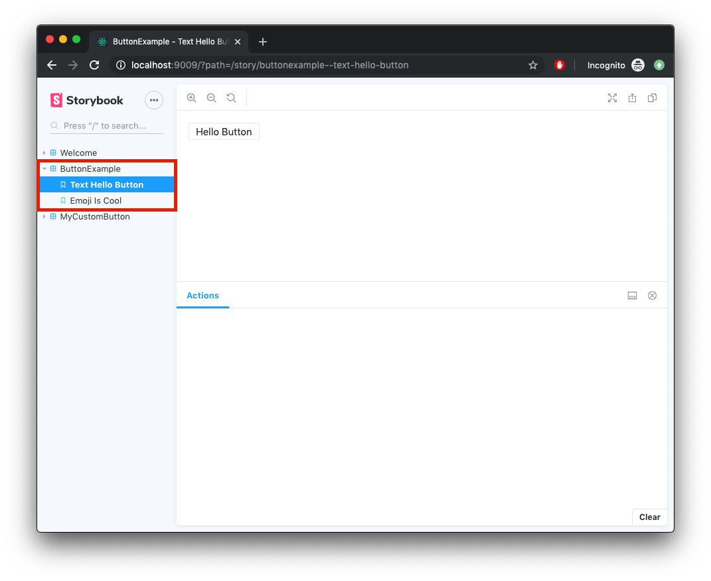
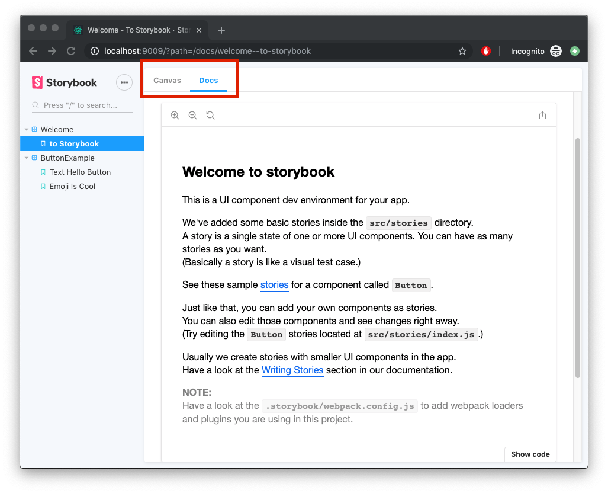
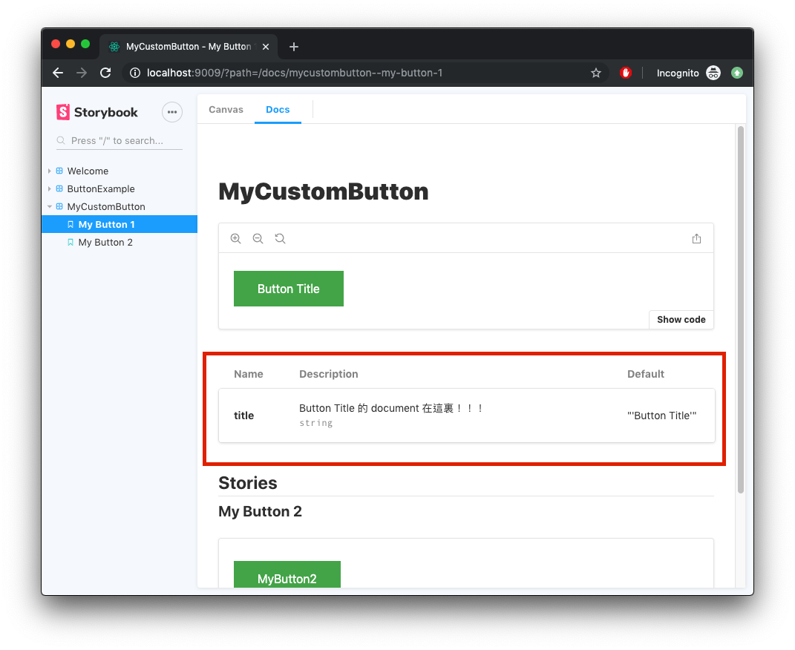

近期因為公司擴張網站系統服務，從原本的主系統延伸出許多子系統，而這些子系統需要樣式、操作流程有個統一的規範與共用同樣的元件庫，希望能盡量減少許多不必要的複製貼上與管理負擔。所以在花了一點時間研究之後，找到了 [Storybook](https://storybook.js.org/) 這樣的 Package。又經過了一段時間的嘗試(踩雷)之後，覺得是可以真正用在公司 Project 上的，所以就想來寫一下當初建立環境與嘗試的過程。

## Storybook 簡介

[Storyboook 官網](https://storybook.js.org/docs/basics/introduction/) intruduction

> Storybook is a user interface development environment and playground for UI components. The tool enables developers to create components independently and showcase components interactively in an isolated development environment.

簡單的來說，Storybook 就是一個 UI components 的開發環境與展示平台，讓你在開發前端元件的同時，將使用範例與文檔一併完成。

## 建立 Storybook 專案

範例 Source code: https://github.com/bugarma/react-storybook-example

要建立一個 Storybook 的專案有許多種方式：
1. 直接透過 Storybook 的 cli 建立
2. 先用 create-react-app(CRA) 初始化專案，再用 Storybook 的 cli 加入 Storybook

我是用第二種方式，因為習慣用 CRA 的架構，公司專案也有需要用到 CRA 的功能。

話不多說，首先建立專案：

```bash
npx create-react-app storybook-example
cd storybook-example

npx -p @storybook/cli sb init
```

如果仔細看一下 terminal 上面的 log，會發現 Storybook 自動偵測到了專案是由 CRA 建立的，進而建立符合 CRA 環境的內容。

所以就不用再多做額外的 config 就可以使用 Storybook 了。

接下來：

```
yarn storybook
```

應該就可以看到 Storybook 的網頁自動開啟。

我們可以對 `src/stories/1-Button.stories.js` 做一點修改看看效果

```jsx
import React from 'react';
import { action } from '@storybook/addon-actions';
import { Button } from '@storybook/react/demo';

export default {
  // 修改 group title
  title: 'ButtonExample',
};

// 修改子項目 title
export const textHelloButton = () => <Button onClick={action('clicked')}>Hello Button</Button>;

// 修改子項目 title
export const emojiIsCool = () => (
  <Button onClick={action('clicked')}>
    <span role="img" aria-label="so cool">
      😀 😎 👍 💯
    </span>
  </Button>
);
```

可以看到旁邊選項的 title 有改變，如下圖:



Storybook 建立 Story(也就是旁邊選項)的格式有三種：
1. [Component Story Format (CSF)](https://storybook.js.org/docs/formats/component-story-format/)
2. [Stories of API](https://storybook.js.org/docs/formats/storiesof-api/)
3. [MDX Syntax](https://storybook.js.org/docs/formats/mdx-syntax/)

我們現在用的就是第一種 CSF。

這時候可能會覺得，有種上當受騙的感覺...

說好的自動產生 DOC 呢？

別急，別急

我們先裝一點東西
```
yarn add prop-types
yarn add -D @storybook/addon-docs
```

修改一下 storybook 的 config：
在 `.storybook` 資料夾底下，新增 `presets.js` 檔案，並貼上以下的 code

```js
// .storybook/presets.js
module.exports = ['@storybook/addon-docs/react/preset'];
```

重新 run ```yarn storybook```

應該就可以看到上方有多一個 `Docs` 的 Tab，裡面就是我們所想要自動產生的 DOC!!!



這時後我們就可以加入自己的 component 與 story了。
__注意： story 需要加在 `src/stories` 裡面，並且命名 `**.stories.js` 才吃的到__

```jsx
// src/components/MyButton.js
import React from 'react';
import PropTypes from 'prop-types';

const buttonStyle = {
  backgroundColor: '#4CAF50',
  border: 'none',
  color: 'white',
  padding: '15px 32px',
  textAlign: 'center',
  textDecoration: 'none',
  display: 'inline-block',
  fontSize: '16px',
}

const MyButton = (props) => {
  return (
    <button style={buttonStyle}>
      {props.title}
    </button>
  );
};

MyButton.propTypes = {
  /** Button Title 的 document 在這裏！！！ */
  title: PropTypes.string,
}

MyButton.defaultProps = {
  title: 'Button Title'
}

export default MyButton;
```

```jsx
// src/stories/2-MyButton.stories.js
import React from 'react';

import MyButton from "../components/MyButton";

export default {
  title: 'MyCustomButton',
  // 中間 Component Document 來源
  component: MyButton
}

export const MyButton1= () => {
  return (
    <MyButton/>
  )
}

export const MyButton2 = () => {
  return (
    <MyButton
      title="MyButton2"
    />
  )
}
```

加入以上兩個檔案之後就可以看到 magic 的部分了！漂亮的文件頁面產生了！

可以注意到以下紅筐的部分：



這是最神奇的地方，裡面的內容是透過 compoent 的 propTypes 與 defaultProps 產生出來的，等於只要做平常的工作，建立好完整的 type checking 機制後，再補上一些註解，Storybook 就可以幫你自動產生文件！！

可以試著修改 `src/component/MyButton.js` 裡面的 propTypes與 defaultProps，看看文件頁面有什麼變動。

## 後記
文章有誤可以 email 給我，或到我的 [github repo](https://github.com/bugarma/react-storybook-example) 開 issue 感謝！！

Storybook 是個好用的工具，但目前官方的文件還不是很完整，也比較少他人使用心得，所以我就寫了入門筆記，希望對想要自己建立元件庫(ex: material-ui、ant-design...等等)的朋友有幫助，畢竟元件庫好不好用，文件真的很重要！

最後，希望喜歡這篇文章的朋友，可以到我的 [github repo](https://github.com/bugarma/react-storybook-example) 按個星星支持一下，謝謝
